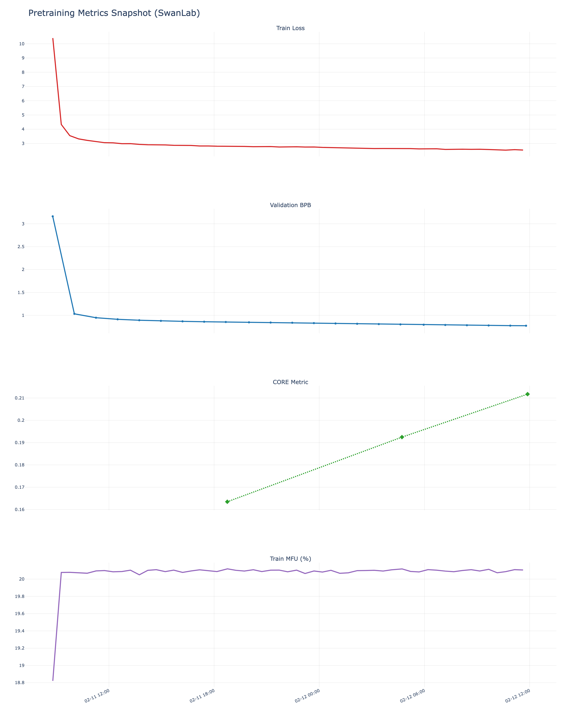
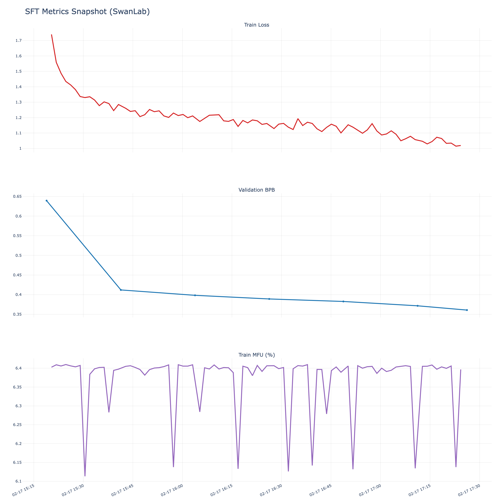
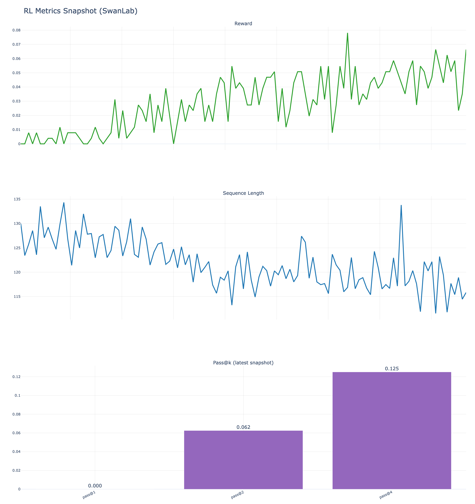

# nanochat-ascend

Ascend NPU-focused fork of [karpathy/nanochat](https://github.com/karpathy/nanochat), adapted to run training on Huawei Ascend (`torch_npu` / CANN) with minimal changes to the original code structure.

This fork keeps nanochat's lightweight, hackable workflow while making the core training path runnable on Ascend 910B-class hardware.

## Status

Experimental, but practical.

This fork has been adapted and validated for the following workflows on Ascend NPU:

- tokenizer train/eval
- base pretraining (`scripts.base_train`)
- base evaluation (`scripts.base_eval`)
- SFT training (`scripts.chat_sft`)
- chat evaluation (`scripts.chat_eval`)

For a more detailed technical breakdown of the adaptation work, see [docs/ascend_npu.md](docs/ascend_npu.md).

## What This Fork Adds (Ascend Adaptation)

Compared with upstream `nanochat`, this fork adds or adjusts:

- `npu` device autodetection in runtime init
- distributed initialization via `HCCL`
- BF16 autocast support on NPU (training + inference paths)
- optimizer fused-step compatibility fixes for `torch_npu` scalar/device ops
- gradient checkpointing in training blocks to reduce memory pressure
- NPU hardware reporting (device name, memory, CANN version)
- NPU-aware cost estimate support in reports
- public Ascend run script template: `runs/run_ascend.sh`

Design goal: keep CUDA behavior unchanged while making Ascend training runnable and reproducible.

## Quick Start (Ascend)

### 1. Prepare environment

You need a working Ascend software stack:

- CANN runtime/toolkit
- PyTorch compatible with your `torch_npu`
- `torch_npu` installed and importable
- `torch.distributed` + `HCCL`

Quick check:

```bash
python - <<'PY'
import torch
print('torch:', torch.__version__)
print('has torch.npu:', hasattr(torch, 'npu'))
if hasattr(torch, 'npu'):
    print('npu available:', torch.npu.is_available())
    if torch.npu.is_available():
        print('device count:', torch.npu.device_count())
        print('device 0:', torch.npu.get_device_name(0))
print('cann:', getattr(torch.version, 'cann', None))
PY
```

### 1.1 Validated Environment (Example)

The current Ascend adaptation was validated on the following machine/software stack (representative setup):

Hardware:

- Ascend NPU: Ascend 910B2 (`64 GB` HBM per card)
- CPU: Kunpeng-920 (`192` cores)
- System architecture: `aarch64` (ARM64)
- System memory: `2.0 TiB` RAM
- Available disk space: ~`1.3 TB`

Software stack:

- OS: Ubuntu 22.04 (kernel string reported as `Linux 4.19.90`)
- CANN: `8.2.RC1` (Driver `24.1.0`)
- Python: `3.11.13`
- PyTorch (`torch_npu`): `2.7.1.dev20250724`

### 2. Configure experiment logging (optional but recommended)

Training scripts in this fork support selectable experiment logging backends:

- `--logger=auto` (default)
- `--logger=wandb`
- `--logger=swanlab`
- `--logger=none`

You can also set the default via environment variable:

```bash
export NANOCHAT_LOGGER=swanlab   # or wandb / none
```

SwanLab (current recommended setup for this fork):

```bash
export SWANLAB_API_KEY=<your_key>
export SWANLAB_WORKSPACE=<your_workspace>   # optional
export SWANLAB_PROJECT=nanochat-train       # optional, per run
```

Weights & Biases (upstream-style logging):

```bash
export WANDB_PROJECT=nanochat
export WANDB_ENTITY=<your_entity>           # optional
```

### 3. Run the Ascend pipeline

An end-to-end template script is provided:

- `runs/run_ascend.sh`

Example:

```bash
export NNPU=4
export DEPTH=26
export DEVICE_BATCH_SIZE=16
bash runs/run_ascend.sh
```

The script is intentionally templated for open-source usage and avoids hardcoded local paths/proxies/credentials.

## Experiment Tracking (WandB / SwanLab)

This fork keeps compatibility with `wandb` and adds first-class `swanlab` support.

The current Ascend NPU experiments in this repository are organized in SwanLab under:

- `nanochat-train` (pretraining)
- `nanochat-sft` (supervised fine-tuning)
- `nanochat-rl` (RL stage / related experiments)

README is a static snapshot. For the most recent runs, check your SwanLab workspace directly.

## SwanLab Experiment Snapshot

The following tables were fetched from SwanLab API on `2026-02-23` and summarize recent Ascend experiment outcomes.

### Summary (Conclusion-Only)

| Stage | Conclusion |
|---|---|
| Pretraining | 4-card Ascend pretraining run completed stably; snapshot metrics include `val/bpb=0.773153`, `core_metric=0.211742`, `train/mfu=20.11%`, `tok/sec=60245`. |
| SFT | 4-card Ascend SFT run completed stably; snapshot metrics include `val/bpb=0.360811`, `train/loss=1.019172`, `train/mfu=6.40%`, `tok/sec=60564`. |
| RL | RL smoke run completed on Ascend and logged reward / sequence length / `pass@k`; snapshot includes `reward=0.0664`, `pass@2=0.0625`, `pass@4=0.125`. |

### `nanochat-train` Metrics Snapshot

| Metric | Latest value |
|---|---:|
| step | 5431 |
| train/loss | 2.537173 |
| val/bpb | 0.773153 |
| core_metric | 0.211742 |
| train/mfu (%) | 20.105848 |
| train/tok_per_sec | 60245 |
| total_training_time (s) | 94383.410977 |
| total_training_flops | 9.223e+18 |

### `nanochat-sft` Metrics Snapshot

| Metric | Latest value |
|---|---:|
| step | 848 |
| train/loss | 1.019172 |
| val/bpb | 0.360811 |
| train/mfu (%) | 6.396784 |
| train/tok_per_sec | 60564 |
| total_training_time (s) | 7283.687244 |
| total_training_flops | 1.858e+18 |

### `nanochat-rl` Metrics Snapshot

| Metric | Latest value |
|---|---:|
| step | 115 |
| reward | 0.066406 |
| sequence_length | 115.832031 |
| lrm | 0.008621 |
| pass@1 | 0 |
| pass@2 | 0.0625 |
| pass@4 | 0.125 |
| pass@8 | - |
| pass@16 | - |

### Trend Charts (Snapshot)

The charts below are static PNG snapshots exported from SwanLab metric history for readability in GitHub README.

Raw snapshot + exported metric CSV files:

- `docs/data/swanlab/latest_runs_snapshot.json`
- `docs/data/swanlab/` (per-metric CSV exports)

Refresh command (re-fetch + re-plot):

```bash
export SWANLAB_WORKSPACE=<your_workspace>
python dev/export_swanlab_snapshot.py
```

#### `nanochat-train` Trend



#### `nanochat-sft` Trend



#### `nanochat-rl` Trend



## Latest SFT Evaluation Snapshot

The latest confirmed SFT eval (`scripts.chat_eval`) result provided for this fork is:

| Task | Accuracy |
|---|---:|
| ARC-Easy | 45.88% |
| ARC-Challenge | 36.35% |
| MMLU | 33.70% |
| GSM8K | 2.50% |
| HumanEval | 9.15% |
| SpellingBee | 99.22% |

These numbers are useful as a baseline when reproducing the Ascend NPU SFT pipeline.

## Reporting Notes (NPU)

`nanochat/report.py` in this fork adds NPU-aware reporting:

- NPU device info + memory + CANN version
- NPU/GPU cost estimates in report header

Local reference pricing used in the Ascend examples/docs:

- Ascend 910B: `3 CNY / hour / card`

GPU fallback pricing (rough Lambda-style USD/hour/card) remains for some models such as H100/A100/V100.

## Key Files

- `docs/ascend_npu.md`: Ascend adaptation notes and usage guide
- `runs/run_ascend.sh`: public end-to-end run template for Ascend
- `scripts/base_train.py`: pretraining (WandB/SwanLab selectable + NPU support)
- `scripts/chat_sft.py`: SFT training (WandB/SwanLab selectable + NPU support)
- `scripts/chat_rl.py`: RL training (WandB/SwanLab selectable)
- `nanochat/common.py`: device init + HCCL + peak FLOPS mapping
- `nanochat/experiment_logger.py`: shared experiment logger adapter (`wandb` / `swanlab` / `none`)
- `nanochat/optim.py`: fused optimizer compatibility fixes for NPU
- `nanochat/report.py`: NPU reporting + cost estimation
- `dev/export_swanlab_snapshot.py`: fetch SwanLab experiment snapshots and render static charts
- `docs/data/swanlab/`: exported SwanLab snapshot JSON + per-metric CSV files
- `docs/assets/swanlab/`: generated metric charts (PNG)

## Known Limitations

- `torch.compile` is disabled on NPU training paths for compatibility/stability.
- `train/mfu` is currently lower than typical well-tuned CUDA/H100 runs (this fork prioritizes correctness and portability first).
- FlashAttention acceleration is not available on Ascend in this fork; attention falls back to PyTorch SDPA paths.
- Ascend performance tuning is not exhaustive yet (kernel/operator coverage and data pipeline tuning can be improved).
- Some log messages/comments may still be CUDA-centric even when runtime supports NPU.
- The Ascend 910B BF16 peak FLOPS mapping is used for MFU estimation and is approximate.
- RL stage coverage is currently demonstrated with smoke-style runs; broader stability/performance validation is still limited.

## Upstream

This project is a fork of `karpathy/nanochat` and aims to keep upstream structure and ergonomics as much as possible.

Upstream repository:

- https://github.com/karpathy/nanochat

If you are looking for the original GPU-focused speedrun/leaderboard documentation, refer to the upstream README and docs.

## License

MIT (same as upstream).
